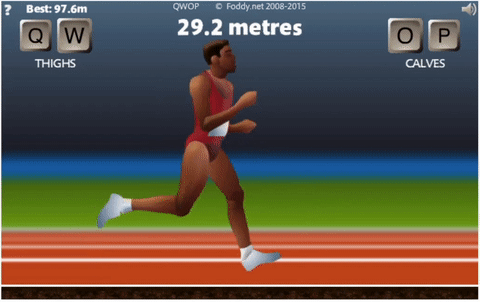

# QWOP-RL

## Description

Train an AI agent to play QWOP using reinforcement learning and imitation learning.



## Setup

Install Python 3.7

```
conda create -n py37 python=3.7
conda activate py37
```

Install dependencies

```
pip install -r requirements.txt
```

Install Windows-specific dependencies if on Windows

```
conda install -c intel mpi4py
```

Install [Chromedriver](https://sites.google.com/a/chromium.org/chromedriver/home) for
interacting with Chrome through Selenium. Then, start HTTP server for the game

```
python host_game.py
```

## Train and test

Train agent

```
python main.py --train
```

Test agent

```
python main.py --test
```

To save or use new models, the constant `MODEL_PATH` in `main.py`. Note that the agent
plays the game in real-time, so differences in latency between training and testing
computer will affect performance.

## Imitation learning

Record games using human input

```
python main.py --record
```

Train agent from recorded games

```
python main.py --imitate
```

## Tensorboard

Track training performance live or view metrics previous sessions

```
tensorboard --logdir ./tensorboard/
```

## Acknowledgements

- The original QWOP game at http://www.foddy.net/Athletics.html
- Lachlan for his help in getting QWOP to run offline.
  https://github.com/etopiei/QWOP-Bot
- Keyboard input inspiration from https://github.com/juanto121/qwop-ai
